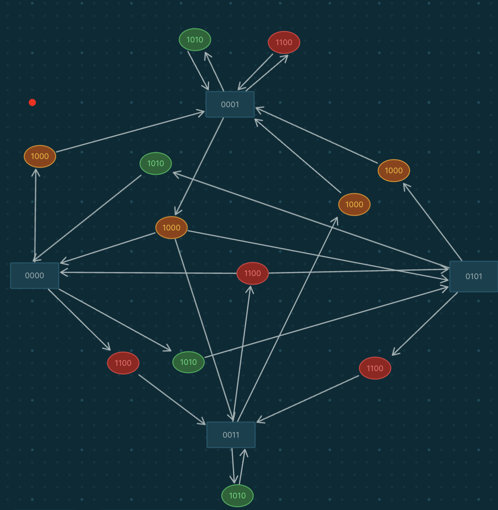

## Series of moves to win

```
1111
1010
1111

1100
1111

1010
1111

1000
1111

1010
1111

1100
1111

1010
1111
```

## Directed graph showing the different states the board can be in



## Proof that I won the challenge


